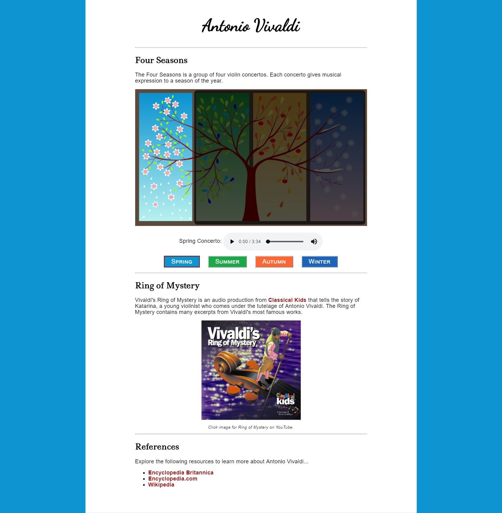

# js-vivaldi
Start Code and Instructions for JS Vivaldi Example

Make the Vivaldi Web Page interactive by completing the following...

If the user clicks the summer button:

<ul>
  <li>Change the text in front of the audio element to 'Summer Concerto'</li>
  <li>Change the main image to 'summer.jpg'</li>
  <li>Change the page background color to match the summer button</li>
  <li>Change the audio source to 'vivaldi-summer.mp3'</li>
  <li>Make it so that the summer button is the only button with the active border</li>
</ul>

If the user clicks the autumn button:

<ul>
  <li>Change the text in front of the audio element to 'Autumn Concerto'</li>
  <li>Change the main image to 'autumn.jpg'</li>
  <li>Change the page background color to match the autumn button</li>
  <li>Change the audio source to 'vivaldi-autumn.mp3'</li>
  <li>Make it so that the autumn button is the only button with the active border</li>
</ul>

If the user clicks the winter button:

<ul>
  <li>Change the text in front of the audio element to 'Winter Concerto'</li>
  <li>Change the main image to 'winter.jpg'</li>
  <li>Change the page background color to match the winter button</li>
  <li>Change the audio source to 'vivaldi-winter.mp3'</li>
  <li>Make it so that the winter button is the only button with the active border</li>
</ul>

If the user clicks the spring button:

<ul>
  <li>Change the text in front of the audio element to 'Spring Concerto'</li>
  <li>Change the main image to 'spring.jpg'</li>
  <li>Change the page background color to match the spring button</li>
  <li>Change the audio source to 'vivaldi-spring.mp3'</li>
  <li>Make it so that the spring button is the only button with the active border</li>
</ul>

  
